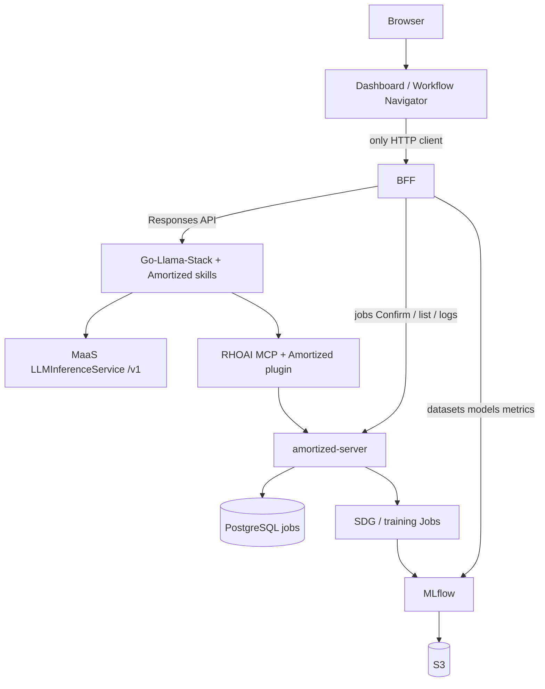
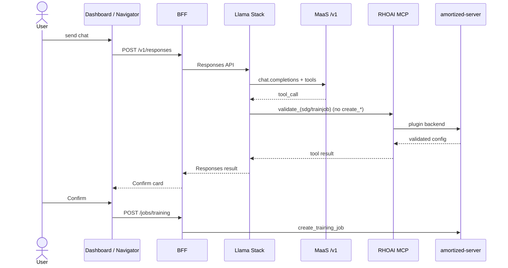

# Amortized Technical Preview Architecture

|                |            |
| -------------- | ---------- |
| Scope          | Amortized on Red Hat OpenShift AI — Technical Preview |
| Status         | Proposed |
| Authors        | TBD |
| Supersedes     | N/A |
| Superseded by: | N/A |
| Tickets        | TBD |
| Other docs:    | [architecture.md](https://github.com/amortized-ai/amortized/blob/main/docs/architecture.md) |

## What

This document is the **Technical Preview (TP)** architecture for Amortized on Red Hat OpenShift AI (RHOAI).

Amortized is a thin orchestration layer. The user describes a repeatable agent task (classification, extraction, routing, summarization). The platform generates synthetic training data from a teacher model, fine-tunes a small student model, and registers the result in MLflow. Inference of that student is out of scope: Models-as-a-Service (MaaS) serves models.

Technical Preview is a **fully productized** RHOAI solution. The install, upgrade, and support contract is the **Amortized operator as a DataScienceCluster component** (`managementState: Managed`): OLM bundle, reconcile loop, status conditions. Helm and kustomize are not TP packages; they are acceptable only for Developer Preview.

The TP product surface is:

| Layer | Role |
| --- | --- |
| UI | Browser SPA (RHOAI dashboard plugin / Navigator / Studio). Talks **only** to the BFF. |
| BFF | Backend-for-frontend. The single UI-facing API. Fans out to every backend the product needs. |
| Agent harness | Go-Llama-Stack and the Responses API. Morty prompts and skills are content loaded into that harness. |
| Tools | Amortized domain plugin on **RHOAI MCP**, acting as the authenticated user. Used by the harness, not by the browser. |
| Control plane | amortized-server: job lifecycle, config translation, Kubernetes Job dispatch. |
| Compute | Kubernetes Jobs for SDG and training. |
| Models | MaaS `LLMInferenceService` for chat and teacher. Student serving remains MaaS, outside Amortized. |

## Why

RHOAI Technical Preview components are operator-managed, identity-aware, and aligned with the platform agent stack.

- **Productization.** TP must install, upgrade, report status, and uninstall cleanly through **DataScienceCluster**. The Amortized operator is that component’s controller. A chart has no reconcile loop and is not a supportable TP. A dedicated operator that never appears on DataScienceCluster is not the TP package.
- **One agent harness.** Workflow Navigator uses Go-Llama-Stack and the Responses API as its agent loop. RHOAI also exposes that same Responses API as the platform agentic interface (Llama Stack / OGX) for RAG and Playground. Amortized is a domain agent on that harness, not a second long-running coding-agent runtime.
- **One MCP plane.** RHOAI MCP already provides domain plugins, the MCP catalog, TokenReview / OIDC, Kubernetes impersonation, and SubjectAccessReview filtering. Amortized tools are a plugin on that server, not a parallel MCP service.
- **One UI protocol.** TP UX is the shared Navigator / dashboard contract. Human confirmation before job create is part of that protocol.
- **One BFF.** The browser never calls Llama Stack, RHOAI MCP, amortized-server, MLflow, or MaaS. The BFF is the only UI-facing service and aggregates those backends.
- **Thin control plane.** Artifacts, lineage, and registry stay in MLflow; compute stays in Kubernetes; serving stays in MaaS. Amortized owns job records, YAML translation, and dispatch.

Training and SDG are long-running Jobs. The agent turn is short-running. Those two lifetimes are not the same process.

## Goals

- Operator-managed TP: DataScienceCluster component (`managementState: Managed`), OLM bundle, reconcile, status, supported upgrade.
- Thin control plane: YAML in, Kubernetes Job out, poll status, MLflow for artifacts and registry.
- Three distinct LLM roles: Morty chat, SDG teacher, student (produced here, served elsewhere).
- Agent loop on Go-Llama-Stack + Responses API; jobs remain Kubernetes Jobs.
- Amortized tools as a RHOAI MCP domain plugin. User bearer token, impersonation, SAR-filtered tool list.
- Human-in-the-loop before job create. The agent cannot create SDG or training jobs.
- Shared RHOAI UI. The UI talks only to the BFF.
- Helm / kustomize restricted to Developer Preview.

## Non-Goals

- Serving the student model inside Amortized.
- Lightspeed Core as the TP harness.
- OpenCode, OpenShell, or an Amortized-owned agent HTTP proxy as the TP Morty runtime.
- Helm, kustomize, or a CRD with no controller as the TP package.
- A dedicated Amortized operator that is not a DataScienceCluster component.
- A second MCP server owned by Amortized.
- The browser calling MLflow, Llama Stack, MCP, MaaS, or amortized-server directly (including an nginx `/mlflow` browser proxy).
- Praxis semantic routing as a TP prerequisite. TP speaks the Responses API so a gateway can route later.
- Productization staffing (which team ships the operator).
- Implementation defects in the existing worker (serial execution, cancel handling, volume layout).

## How

### System context

The UI has a **backend-for-frontend**. Every user-facing call from the browser terminates on the BFF. The BFF, not the SPA, talks to Llama Stack, amortized-server, MLflow, and (if needed) other platform APIs. The agent harness still calls RHOAI MCP on the cluster; that path is not a browser path.

Platform prerequisites (not Amortized operands): GPU pool, GPU Operator, a **DataScienceCluster** (RHOAI already running), MaaS / `LLMInferenceService` with tool calling, Llama Stack / OGX, RHOAI MCP, MLflow and object storage already on the cluster. TP enables Amortized on that DataScienceCluster (`managementState: Managed`).

### BFF

The BFF is an operator operand and the **only** Route the product UI uses.

| UI need | BFF upstream |
| --- | --- |
| Chat / agent turn | Llama Stack Responses API |
| Validate / prepare job (agent tools) | Not the browser — Llama Stack → RHOAI MCP → amortized-server |
| Confirm create, list, cancel, logs | amortized-server REST |
| Datasets, models, metric history | MLflow |
| Config, pricing, VRAM cards | amortized-server REST |

The BFF forwards the authenticated user identity on every upstream call. It does not expose MCP to the browser. It does not start Jobs itself; Confirm is a BFF → amortized-server create.

The BFF may share a codebase with amortized-server. It is a **separate network identity**: UI NetworkPolicy allows only the BFF; amortized-server, Llama Stack, MCP, and MLflow are cluster-internal.

### Packaging

| Stage | Package |
| --- | --- |
| Developer Preview | Helm or kustomize allowed |
| Technical Preview | **Amortized operator required** with DataScienceCluster component (`managementState: Managed`) |

A CRD with no controller is not a package. Helm and the operator must not manage the same objects.

### Operator

Amortized is enabled with `managementState: Managed`. The Amortized operator is the controller for that component.

The operator reconciles:

- Product UI (dashboard plugin and/or Studio static assets). The UI is a browser SPA only.
- **BFF** (UI-facing Service + Route, OAuth on this Route). Orchestrates Llama Stack, amortized-server, and MLflow.
- amortized-server (job worker and control-plane API). Cluster-internal. Plugin backend for RHOAI MCP, not a public UI API.
- Jobs namespace RBAC and the Job / ConfigMap / Secret lifecycle the worker already uses.
- PostgreSQL binding, or a documented external database.
- Morty skill ConfigMaps consumed by Llama Stack.
- Registration of the Amortized domain on RHOAI MCP (in-tree plugin or catalog entry the operator owns).
- Binding to the cluster `LLMInferenceService` (`baseURL`, `model`). The LLM workload itself is a platform prerequisite.

The operator does not reconcile OpenCode, an OpenShell Sandbox, or a privileged sandbox service account. It does not put a Route on amortized-server, Llama Stack, MCP, or MLflow for the product UI.

Status conditions: `UiReady`, `BffReady`, `ServerReady`, `McpPluginReady`, `LlmReachable`, `JobsRbacReady`.

### LLM roles

| Role | Caller | Endpoint |
| --- | --- | --- |
| Morty chat | Llama Stack | MaaS `LLMInferenceService` `/v1` (tool calling required) |
| SDG teacher | Data Designer Job | Same `/v1` or a second MaaS model |
| Student | Training Job output | Produced by Amortized; serving is MaaS |

### Agent and skills

One Amortized domain agent. SDG and training are skills (or sequential MCP), not extra runtimes.

The agent has no filesystem, shell, or code-execution tools — MCP only. Isolation is the RHOAI MCP allowlist, user token, and NetworkPolicy, not a privileged sandbox supervisor.

Job create is withheld from the agent tool list. The UI Confirm path is the only create path: **UI → BFF → amortized-server** (`create_sdg_job`, `create_training_job`).

Cross-domain routing (for example model recommendation vs post-training) belongs at Praxis when that gateway is available. Amortized does not implement a second router.

### Control plane

Unchanged relative to the product’s orchestration model:

- One `jobs` table; builders for `sdg`, `training`, and internal `upload`.
- Config translation to Data Designer and training-hub YAML.
- `parent_job_id` one-hop chaining (SDG or upload → training).
- MLflow is the only artifact store. Amortized does not write S3 directly.
- Production compute backend is Kubernetes Jobs.

Details of job state machine, builders, and APIs: [architecture.md](https://github.com/amortized-ai/amortized/blob/main/docs/architecture.md).

### Authentication and authorization

- The TP API is authenticated. An unset API key must not mean “open.”
- RHOAI MCP validates the user with TokenReview or OIDC, impersonates that user, and hides tools the user cannot SAR.
- Jobs are attributed and authorized as that user.
- Training and SDG pods run under the **server job** service account in the jobs namespace, not under the chat harness identity.
- OAuth terminates on the **BFF Route** (or the dashboard BFF the plugin uses). The SPA stores no backend URLs except the BFF.
- The BFF forwards the user token to Llama Stack, amortized-server, and MLflow. Those services are not on the public Route.

## Open Questions

1. One `LLMInferenceService` for Morty and teacher vs a small chat model plus a larger teacher.
2. Whether the BFF is a dedicated Deployment or a second Service on a shared amortized-server binary. Network identity must stay UI-facing BFF vs cluster-internal control plane either way.
3. If an in-tree RHOAI MCP plugin cannot land in TP, a catalog-registered server with the same user-token model, owned as an operator operand, is the fallback — not an open Service.

## Alternatives

### OpenCode in OpenShell

A long-running `opencode serve` process in an OpenShell sandbox matches some agent starter kits and adds landlock / egress isolation. It requires a privileged sandbox supervisor, a custom session proxy, and a second harness beside Llama Stack. TP isolation for Morty is MCP + user token + NetworkPolicy. Rejected for TP.

### Helm or kustomize as the TP package

Charts reach a cluster quickly and fit GitOps. They do not reconcile, do not expose supportable status, and are not a productized RHOAI TP. Rejected for TP. Allowed for Developer Preview only.

### Dedicated operator with no DataScienceCluster component

A standalone OLM operator that never appears on DataScienceCluster can still reconcile operands. RHOAI TP components are enabled and supported on DataScienceCluster (`managementState: Managed`). Rejected for TP.

### CRD with no controller

A custom resource with no operator does not install, upgrade, or uninstall the product. Rejected.

### Lightspeed Core

A heavy agent framework overlapping Go-Llama-Stack + Responses API. Rejected for TP.

### Independent Amortized MCP server

Exposing the FastAPI surface as a second MCP server duplicates RHOAI MCP and typically runs with a service identity or an open API. Rejected for TP.

### Studio nginx proxying backends from the browser

Studio today can call amortized-server and MLflow through nginx from the browser. That skips a BFF and leaks backend APIs to the client. Rejected for TP. The SPA talks only to the BFF.

## Security and Privacy Considerations

- The agent may call only RHOAI MCP tools the user can SAR. Those tools cannot create jobs without UI Confirm.
- SDG and training Jobs use the server’s jobs SA, not the user’s chat token, for cluster create of Job objects. User authorization is enforced at the API before dispatch.
- No privileged SCC for the Morty runtime.
- No OAuth sidecar on Llama Stack, MCP, or amortized-server.
- The BFF is the trust boundary for the browser: it is the only service that accepts user sessions and fans out with impersonation / forwarded tokens.
- Skills and prompts are ConfigMaps, not a model-writable workspace.

## Risks

- Operator delivery (DSC component, bundle, operands, status, upgrades) is the TP critical path.
- Shared UI may not yet cover every Morty card (pricing, VRAM). Mitigation: extend the shared protocol; do not fork a second chat client for TP.
- RHOAI MCP plugin slot may slip. Mitigation: catalog-registered operand with identical auth.
- MaaS model must support tool calling or the agent loop cannot drive MCP.

## Stakeholder Impacts

| Group | Impacted? |
| --- | --- |
| Amortized control plane | Yes — DSC component, BFF, auth, MCP plugin |
| RHAI UX | Yes — SPA talks only to BFF; shared Confirm protocol |
| Workflow Navigator / Llama Stack | Yes — skills and Responses API consumer (via BFF, not the browser) |
| RHOAI MCP | Yes — Amortized domain plugin |
| RHOAI operator / DataScienceCluster | Yes — TP package is a DSC component (`managementState: Managed`) |
| MaaS / llm-d | Yes — chat and teacher `LLMInferenceService` |
| MLflow / storage | Binding only; not re-bundled |

## References

* [architecture.md](https://github.com/amortized-ai/amortized/blob/main/docs/architecture.md) — control plane, jobs, artifacts, and APIs as implemented
* [opendatahub-io/rhoai-mcp](https://github.com/opendatahub-io/rhoai-mcp) — RHOAI MCP plugins, TokenReview, impersonation, SAR
* [RHOAI MCP catalog](https://www.redhat.com/en/blog/mcp-catalog-here-discover-deploy-and-connect-red-hat-openshift-ai)
* [Diagrams](../diagrams/) — cluster topology, request path, operator tenancy, trust flow (draw.io + PNG)

## Reviews

| Reviewed by | Notes |
| --- | --- |
| TBD | |
